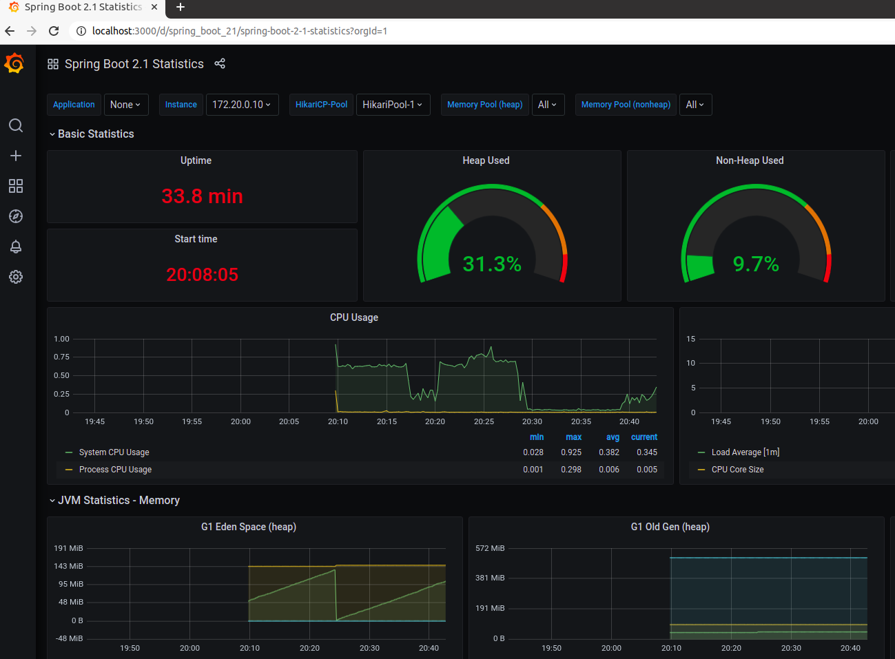

# microservices-with-istio-service-mesh

The idea of this project is to show how to migrate from a traditional microservice architecture to `kubernetes and istio`.

## Requirements

 - JDK 8+
 - Maven 3.6.3+
 - Docker 19+
 - Minikube
 - Python3(only need for folder `aggregator-service`) 

## Classical Microservice Architecture non k8s/istio

In a `microservice world` you usually apply a few design patterns like [Service-discovery](https://microservices.io/patterns/server-side-discovery.html), [Externalized Configuration](https://microservices.io/patterns/externalized-configuration.html), [API Gateway](https://microservices.io/patterns/apigateway.html), [Distributed Tracing](https://microservices.io/patterns/observability/distributed-tracing.html), [Access Token](https://microservices.io/patterns/security/access-token.html) and so on.
 
Your architecture might be something like that.


PS: Full list at [design patterns](https://microservices.io/patterns/microservices.html).

As you can see your microservice is not so `micro` as it has a few dependencies from others `services/tools`.

The `Business value` for your product is there but together with a bunch of other things.

Your microservices might need some extra dependencies and could end up be something like:

```xml
<!-- Distributed Tracing -->
<dependency>
    <groupId>org.springframework.cloud</groupId>
    <artifactId>spring-cloud-starter-zipkin</artifactId>
</dependency>

<!-- Config Client -->
<dependency>
    <groupId>org.springframework.cloud</groupId>
    <artifactId>spring-cloud-starter-config</artifactId>
</dependency>

<!-- Discovery Client -->
<dependency>
    <groupId>org.springframework.cloud</groupId>
    <artifactId>spring-cloud-starter-netflix-eureka-client</artifactId>
</dependency>

<!-- Health Check -->
<dependency>
    <groupId>org.springframework.boot</groupId>
    <artifactId>spring-boot-starter-actuator</artifactId>
</dependency>

<!-- Metrics -->
<dependency>
    <groupId>io.micrometer</groupId>
    <artifactId>micrometer-registry-prometheus</artifactId>
</dependency>
```

PS: Full example at [pom.xml](person-service/pom.xml)

Now let's say you need `Service A` to call `Service B` following example with `Spring Boot`

```java
@SpringBootApplication
class Application {
    public static void main(String[] args) {
      SpringApplication.run(Application.class, args);
  }

  @LoadBalanced //This is needed
  @Bean
  RestTemplate restTemplate() {
      return new RestTemplate();
  }
}

class ServiceA {
    @Autowired
    RestTemplate restTemplate;
  
    void execute() {
        HelloObject helloObject = restTemplate.getForObject("http://service-a/hello", ServiceBDto.class);
        //do something here
    }
}
```

Or with `Quarkus` and Eureka Client

```java
@Path("/api/todos")
@Produces(MediaType.APPLICATION_JSON)
@Consumes(MediaType.APPLICATION_JSON)
@RequestScoped
public class TodoResource {
    @Inject
    @LoadBalanced(type = LoadBalancerType.ROUND_ROBIN)
    EurekaClient eurekaClient;

    PersonDto getPersonNameByEureka(String personId) {
        return eurekaClient.app("person-service")
                .path("/api/people/" + personId)
                .request(MediaType.APPLICATION_JSON_TYPE)
                .header(HttpHeaders.AUTHORIZATION, jwt.getRawToken())
                .get()
                .readEntity(PersonDto.class);
    }
}
``` 

PS: Full example at [TodoResource.java](todo-service/src/main/java/com/github/todo/TodoResource.java#L120)

You may also need to `secure` your services and may use `JWT`.

```java
@Path("/api/todos")
@Produces(MediaType.APPLICATION_JSON)
@Consumes(MediaType.APPLICATION_JSON)
@RequestScoped
public class TodoResource {
    @Path("/getTotalCategory")
    @GET
    @RolesAllowed("**") //Secure endpoint
    public Response getTotalCategory(@QueryParam("plannedEndDate") Date plannedEndDate) {
        return Response.ok(map).build();
    }
}
```

Cool now we need to expose our services(`API Gateway`) and a tool(`Spring Boot Admin`) for monitoring, something to collect metrics(`Prometheus`) from our apis and a nice dashboard(`Grafana`) to display it, at last but not least a tool(`Zipkin`) for tracing the requests.

API Gateway - [Spring Cloud Netflix Zuul](https://cloud.spring.io/spring-cloud-netflix/multi/multi__router_and_filter_zuul.html) 


Monitoring - [Spring Boot Admin](https://github.com/codecentric/spring-boot-admin) 


Metrics - [Prometheus](https://prometheus.io/) 


Dashboard - [Grafana](https://grafana.com/) 



Tracing - [Zipkin](https://zipkin.io/) 


As you can see there are a lot of things to maintain and the most important(`business value`) part is quite small(`todo, person and aggregator services`), of course this is just a silly example but now think in a `real world` with hundreds of microservices with business values how this can be `challengeable/mess`. 

## Microservice Architecture using k8s/istio