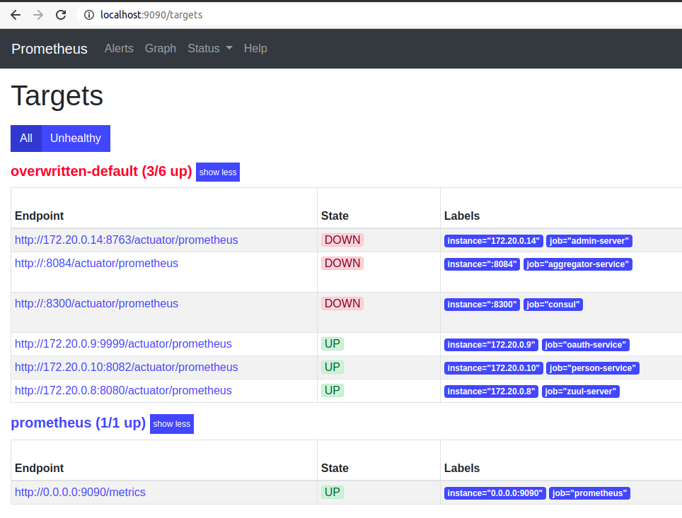
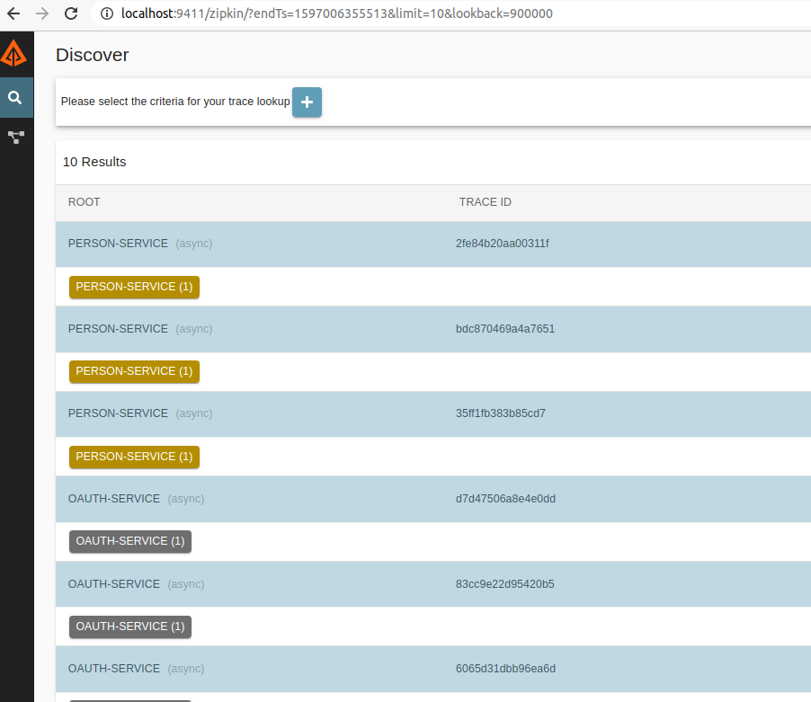

# microservices-with-istio-service-mesh

The idea of this project is to show how to migrate from a `traditional microservices architecture` to use `Kubernetes with Istio`.

More details https://www.linkedin.com/pulse/microservices-istio-rodrigo-rodrigues/?trackingId=xs3J2k%2FPRlWsVSDRUNYyow%3D%3D

## Requirements

 - JDK 8+
 - Maven 3.6.3+
 - Docker 19+
 - Minikube
 - Python3 

## Classical Microservice Architecture non k8s/istio

In a `microservice world` you usually apply a few design patterns like [Service-discovery](https://microservices.io/patterns/server-side-discovery.html), [Externalized Configuration](https://microservices.io/patterns/externalized-configuration.html), [API Gateway](https://microservices.io/patterns/apigateway.html), [Distributed Tracing](https://microservices.io/patterns/observability/distributed-tracing.html), [Access Token](https://microservices.io/patterns/security/access-token.html) and so on.
 
Your architecture might be something like that.


PS: Full list at [design patterns](https://microservices.io/patterns/microservices.html).

As you can see your microservice is not so `micro` as it has a few dependencies from others `services/tools`.

The `Business value` for your product is there but together with a bunch of other things.

Your microservices might need some extra dependencies and could end up be something like:

```xml
<!-- Distributed Tracing -->
<dependency>
    <groupId>org.springframework.cloud</groupId>
    <artifactId>spring-cloud-starter-zipkin</artifactId>
</dependency>

<!-- Config Client -->
<dependency>
    <groupId>org.springframework.cloud</groupId>
    <artifactId>spring-cloud-starter-consul-config</artifactId>
</dependency>

<!-- Discovery Client -->
<dependency>
    <groupId>org.springframework.cloud</groupId>
    <artifactId>spring-cloud-starter-consul-discovery</artifactId>
</dependency>

<!-- Health Check -->
<dependency>
    <groupId>org.springframework.boot</groupId>
    <artifactId>spring-boot-starter-actuator</artifactId>
</dependency>

<!-- Metrics -->
<dependency>
    <groupId>io.micrometer</groupId>
    <artifactId>micrometer-registry-prometheus</artifactId>
</dependency>
```

PS: Full example at [pom.xml](person-service/pom.xml)

Now let's say you need `Service A` to call `Service B` following example with `Spring Boot`

```java
@SpringBootApplication
class Application {
    public static void main(String[] args) {
      SpringApplication.run(Application.class, args);
  }

  @LoadBalanced //This is needed
  @Bean
  RestTemplate restTemplate() {
      return new RestTemplate();
  }
}

class ServiceA {
    @Autowired
    RestTemplate restTemplate;
  
    void execute() {
        HelloObject helloObject = restTemplate.getForObject("http://service-a/hello", ServiceBDto.class);
        //do something here
    }
}
```

Or with `Quarkus` and Eureka Client

```java
@Path("/api/todos")
@Produces(MediaType.APPLICATION_JSON)
@Consumes(MediaType.APPLICATION_JSON)
@RequestScoped
public class TodoResource {
    @Inject
    @LoadBalanced(type = LoadBalancerType.ROUND_ROBIN)
    EurekaClient eurekaClient;

    PersonDto getPersonNameByEureka(String personId) {
        return eurekaClient.app("person-service")
                .path("/api/people/" + personId)
                .request(MediaType.APPLICATION_JSON_TYPE)
                .header(HttpHeaders.AUTHORIZATION, jwt.getRawToken())
                .get()
                .readEntity(PersonDto.class);
    }
}
``` 

PS: Full example at [TodoResource.java](todo-service/src/main/java/com/github/todo/TodoResource.java#L120)

You may also need to `secure` your services and may use `JWT`.

```java
@Path("/api/todos")
@Produces(MediaType.APPLICATION_JSON)
@Consumes(MediaType.APPLICATION_JSON)
@RequestScoped
public class TodoResource {
    @Path("/getTotalCategory")
    @GET
    @RolesAllowed("**") //Secure endpoint
    public Response getTotalCategory(@QueryParam("plannedEndDate") Date plannedEndDate) {
        return Response.ok(map).build();
    }
}
```

Cool now we need to expose our services(`API Gateway`) and a tool(`Spring Boot Admin`) for monitoring, something to collect metrics(`Prometheus`) from our apis and a nice dashboard(`Grafana`) to display it, at last but not least a tool(`Zipkin`) for tracing the requests.

API Gateway - [Spring Cloud Netflix Zuul](https://cloud.spring.io/spring-cloud-netflix/multi/multi__router_and_filter_zuul.html) 


Monitoring - [Spring Boot Admin](https://github.com/codecentric/spring-boot-admin) 


Metrics - [Prometheus](https://prometheus.io/) 



Dashboard - [Grafana](https://grafana.com/) 


Tracing - [Zipkin](https://zipkin.io/) 



As you can see there are a lot of things to maintain and the most important(`business value`) part is quite small(`todo, person and aggregator services`), of course this is just a silly example but now think in a `real world` with hundreds of microservices with business values how this can be `challengeable/mess`. 

## Maven

```
#root folder
mvn clean install

# specific project
mvn -B -f zuul-server/pom.xml clean install 


# generate docker image
mvn -B -f zuul-server/pom.xml jib:dockerBuild
```

## Docker

cd `docker-compose`

```
docker-compose up -d
```

## Microservice Architecture using k8s/istio

## minikube

```
kubectl create configmap application --from-file=../docker-compose/config-server/application.yml

kubectl create configmap istio-oauth-service --from-file=../docker-compose/config-server/oauth-service.yml

kubectl auth can-i get configmap --as=system:serviceaccount:default:default -n default

kubectl describe AuthorizationPolicies -n istio-system

kubectl describe RequestAuthentication -n istio-system
```

### Pushing Docker images to Cloud Provider

Once [docker images are built](https://github.com/rodrigorodrigues/quarkus-vs-springboot-reactive-rest-api#docker-build) you can tag/push docker images to Google Cloud(or another cloud provider).

```
docker tag quarkus:latest eu.gcr.io/YOUR_PROJECT/quarkus:latest
docker push eu.gcr.io/YOUR_PROJECT/quarkus
```

PS: Change `YOUR_PROJECT` to yours.

### Deploying Pods

```
kubectl apply -f deployment-mongo.yml
kubectl apply -f deployment-postgres.yml
kubectl apply -f rbac.yaml
kubectl apply -f deployment-istio-oauth-service.yml
kubectl apply -f deployment-istio-person-service.yml
kubectl apply -f deployment-todo-service.yml
kubectl apply -f deployment-istio-gateway.yml
```

### Using Minikube with Istio

- Install kubectl

Follow instructions https://kubernetes.io/docs/tasks/tools/install-kubectl/#install-kubectl-on-linux

- Install minikube

Follow instructions https://kubernetes.io/docs/tasks/tools/install-minikube/

 - Start Minikube with Virtualbox

```
minikube start --memory=8192 --cpus=4 --vm-driver=virtualbox
```

- Docker-env
 
```shell script
eval $(minikube docker-env)
```

Follow instructions https://stackoverflow.com/questions/42564058/how-to-use-local-docker-images-with-minikube

PS: All commands should be in the same `terminal console` or setting `docker-env command` for each terminal console.

 - Create Secrets

```
kubectl create secret generic privatekey --from-file=../docker-compose/dummyAuthPrivateKey.pem

kubectl create secret generic publickey --from-file=../docker-compose/dummyAuthPublicKey.pem
```

- ConfigMaps

```
kubectl create configmap application --from-file=../docker-compose/config-server/application.yml

kubectl create configmap istio-oauth-service --from-file=../docker-compose/config-server/oauth-service.yml
```

 - Rebuild images
 
Follow instructions https://github.com/rodrigorodrigues/quarkus-vs-springboot-reactive-rest-api#docker-build

- Deploying pods

Check [previous](#deploying-pods) section.

- Check if pods are running

```shell script
kubectl get pods --show-labels
```

- Accessing pods by `port-forward`

```shell script
# Spring Boot
kubectl port-forward $(kubectl get pod --selector="app=spring-boot" --output jsonpath='{.items[0].metadata.name}') 8080:8080

# Quarkus
kubectl port-forward $(kubectl get pod --selector="app=quarkus" --output jsonpath='{.items[0].metadata.name}') 8081:8081
```
It should open access to http://localhost:8080/swagger-ui.html and for Quarkus port `8081` to call endpoints.

- Istio

Follow instructions https://istio.io/docs/setup/getting-started/

```shell script
# Download latest version
curl -L https://git.io/getLatestIstio | sh -

# Add istioctl to classpath
export PATH=$PWD/bin:$PATH

# Install istio
istioctl manifest apply --set profile=demo

# Add istio-injection for a namespace
kubectl label namespace default istio-injection=enabled

# Check list of pods on istio-system namespace
kubectl get pods --show-labels --namespace istio-system

# Export Ingress host
export INGRESS_HOST=$(minikube ip)

# Export Port
export INGRESS_PORT=$(kubectl -n istio-system get service istio-ingressgateway -o jsonpath='{.spec.ports[?(@.name=="http2")].nodePort}')

# Export Gateway Url
xport GATEWAY_URL=$INGRESS_HOST:$INGRESS_PORT

# Call api to generate valid JWT
curl -H "Content-Type: application/x-www-form-urlencoded" -v -X POST admin:admin@$GATEWAY_URL/oauth/token -dgrant_type=client_credentials

# Call api to return list of people
curl -H "Content-Type: application/json" -H "Authorization: Bearer XXX" -v -X GET $GATEWAY_URL/api/people

# Apply debug on Istio Ingress
kubectl exec $(kubectl get pods -l istio=ingressgateway -n istio-system -o jsonpath='{.items[0].metadata.name}') -c istio-proxy -n istio-system -- curl -X POST "localhost:15000/logging?filter=debug" -s
```

PS 1: List of users [oauth-service.yml](docker-compose/config-server/oauth-service.yml)

PS 2: If for some reason Istio `suddenly` stop working easier to recreate `minikube stop/start`.

## References

https://developers.redhat.com/books/introducing-istio-service-mesh-microservices

https://medium.com/google-cloud/back-to-microservices-with-istio-p1-827c872daa53

https://medium.com/google-cloud/back-to-microservices-with-istio-part-2-authentication-authorization-b079f77358ac

https://istio.io/latest/docs/setup/getting-started/

https://github.com/redhat-scholars/istio-tutorial